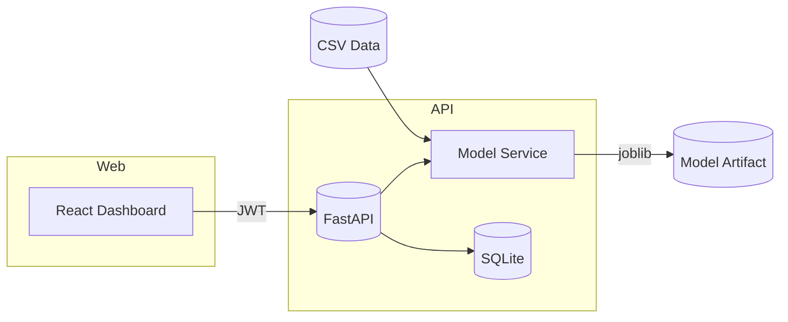
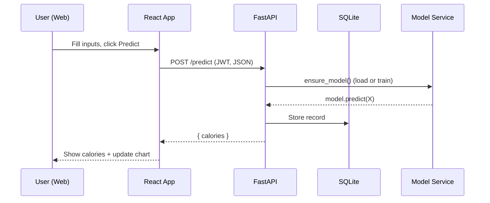

# Workflow & Architecture

## Logical Architecture

```mermaid
flowchart LR
  subgraph Web
    UI[React Dashboard]
  end
  subgraph API
    A[(FastAPI)] --> MS[Model Service]
    A --> DB[(SQLite)]
  end
  UI -->|JWT| A
  MS -->|joblib| ART[(Model Artifact)]
  D[(CSV Data)] --> MS
```

## Predict Sequence

```mermaid
sequenceDiagram
  participant U as User (Web)
  participant UI as React App
  participant API as FastAPI
  participant DB as SQLite
  participant MS as Model Service
  U->>UI: Fill inputs, click Predict
  UI->>API: POST /predict (JWT, JSON)
  API->>MS: ensure_model() (load or train)
  MS-->>API: model.predict(X)
  API->>DB: Store record
  API-->>UI: { calories }
  UI-->>U: Show calories + update chart
```
