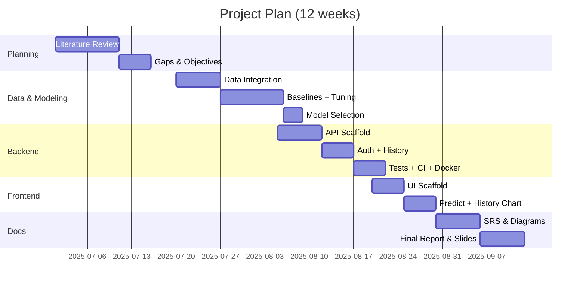
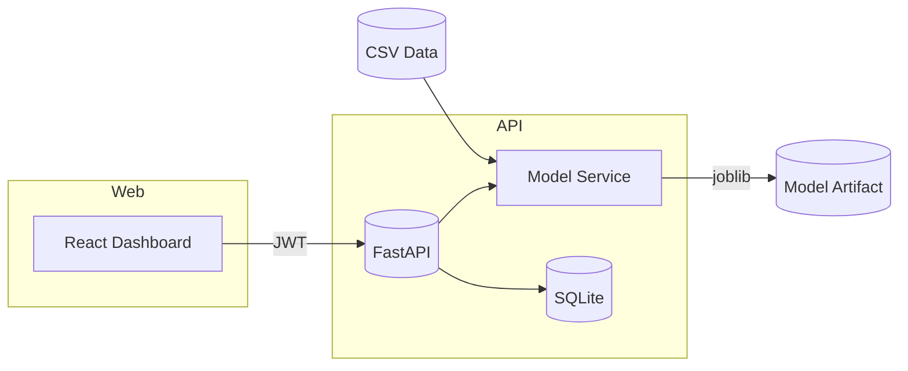
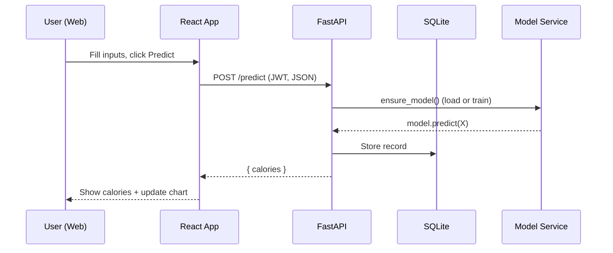

# AI‑Based Real‑Time Fitness and Health Tracker — Presentation Pack

This document covers the required sections for your review: literature review, gaps, objectives, specs, Gantt/WBS, SRS, workflow/architecture, module design & implementation coverage, and report outline.

---

## 1) Literature Review

- Sensor‑driven fitness analytics leverage accelerometer, gyroscope, and HR to recognize activities and estimate energy expenditure (Zhang & Lee, 2021; Kim & Choi, 2023).
- Machine learning (RF, SVM, boosting) has shown strong performance for activity classification and calorie regression; XGBoost is competitive for tabular sensor data (Thomas & Williams, 2020).
- Fusion of HR with inertial signals improves accuracy over single‑source inputs (Kumar & Thomas, 2020).
- Real‑time systems require low‑latency inference and streaming pipelines; embedded/edge inference is common to preserve privacy (Lee & Park, 2021; Garcia & Roberts, 2021).
- Privacy: local processing, minimization of personally identifying information, and clear consent are recommended (Wang, 2023; Patel & Zhang, 2023).
- Current open datasets vary in sensor richness and ground‑truth methodology; many lack continuous, individualized calibration.

References: (from your report) Zhang & Lee 2021; Smith & Kumar 2020; Brown & Chen 2019; Wang 2023; Johnson & Patel 2022; Lee & Park 2021; Thomas & Williams 2020; Kim & Choi 2023; Nguyen & Tran 2022; Patel & Zhang 2023; Garcia & Roberts 2021; Kumar & Thomas 2020.

---

## 2) Research Gaps

- Fragmented pipelines: activity recognition and calorie estimation often built separately; limited end‑to‑end systems combining both in real‑time.
- Limited multi‑sensor fusion: many solutions rely on single inputs (e.g., steps or HR only) without robust fusion or calibration.
- Personalization: few implement individualized adaptation (per‑user offsets/online learning).
- Real‑time guarantees: latency and throughput targets not consistently enforced/measured.
- Privacy‑by‑design: local‑first processing and data minimization under‑addressed in prior apps.

---

## 3) Objectives (SMART)

- O1: Build a local‑first API that predicts calories from personal and exercise metrics with MAE ≤ target threshold on held‑out data.
- O2: Achieve end‑to‑end latency < 1s per prediction on a mid‑range laptop.
- O3: Provide a web dashboard for login → predict → history with real‑time charting and persistence.
- O4: Implement training pipeline with baseline models and Optuna tuning; persist best model to artifact store.
- O5: Ship Docker & CI; prepare deployment‑ready documentation.

Success criteria: MAE (kcal), P50/P95 latency (ms), functional coverage (auth, predict, history), reproducible training, CI green.

---

## 4) Hardware & Software Specifications

- Hardware (dev): 4‑8GB RAM, multi‑core CPU. Optional BLE HR sensor for future extensions.
- OS: Windows 10/11 (dev); Docker for runtime parity.
- Backend: Python 3.11, FastAPI, Uvicorn, SQLAlchemy (SQLite), python‑jose, passlib[bcrypt], scikit‑learn, XGBoost, Optuna, joblib.
- Web: Node 22, React + Vite + TypeScript, ECharts, fetch API.
- Tooling: Git, GitHub Actions CI, Docker, docker‑compose.

---

## 5) Gantt Chart & Work Breakdown Structure (WBS)

WBS (high‑level)
- 1.0 Planning (Review, Gaps, Objectives)
- 2.0 Data & Modeling (Integration, Baselines, Tuning, Selection)
- 3.0 Backend (API, Auth, History, Tests, CI, Docker)
- 4.0 Frontend (Scaffold, Forms, Charting, Polish)
- 5.0 Documentation (SRS, Diagrams, Report, Slides)

---

## 6) Software Requirements Specification (SRS)

- Scope: Local‑first calorie prediction service with secure API and web dashboard for authenticated users.
- Actors: User (member), System (API), Database.
- Functional Requirements
  - FR1: Users can register and login (JWT auth).
  - FR2: Authenticated users can submit inputs (age, gender, height, weight, duration, heart_rate, body_temp) and receive predicted calories.
  - FR3: System stores each prediction with inputs, user, and timestamp.
  - FR4: Users can retrieve recent history (≤ 50).
  - FR5: Admin/system can train a model via CLI and store the artifact.
- Non‑Functional Requirements
  - NFR1: Latency < 1s per request on target hardware.
  - NFR2: MAE within target threshold on held‑out split.
  - NFR3: Local‑first storage; no external data egress by default.
  - NFR4: Availability ≥ 99% for demo; graceful error handling.
  - NFR5: Security: hashed passwords, JWT tokens, CSRF‑safe usage from SPA.
- Data Requirements
  - Tables: `users(id, username, password_hash, created_at)`, `predictions(id, user_id, inputs..., calories, created_at)`.
  - Artifact: `backend/models/calories_xgb.joblib`.
- Constraints: Python 3.11; dataset shape/features as per Kaggle demo files.

---

## 7) Workflow / Architecture

Architecture (logical)

Sequence (predict)

---

## 8) Module Design & Implementation (≥ 40% complete)

Implemented (code‑complete):
- Backend
  - Auth: `POST /auth/register`, `POST /auth/login` (bcrypt + JWT)
  - Predict: `POST /predict` (validates, loads/trains model, stores history)
  - History: `GET /history` (last 50 for current user)
  - Persistence: SQLAlchemy models (`User`, `Prediction`), SQLite
  - Model service: joblib load/save, Optuna tuning in CLI
  - CI & Docker: GitHub Actions, Dockerfile, compose
- Frontend (React)
  - Login page (navigates on success)
  - Dashboard: labeled inputs, Predict action, History table, ECharts line chart
  - About section explaining what is predicted and how

Planned/optional next:
- Tailwind integration, i18n, PWA, CSV import/export; rate limiting; Postgres + Alembic migrations; MLflow + DVC.

---

## 9) Report (Hard Copy) — Outline

- Title, Team, Abstract
- 1. Introduction (Background, Motivation, Scope)
- 2. Literature Review & Gaps
- 3. Objectives & Success Criteria
- 4. Requirement Analysis (SRS)
- 5. System Design (Architecture, Data Flow, Diagrams)
- 6. Implementation (Backend, Modeling, Frontend)
- 7. Experiments & Results (Baselines, Tuning, Metrics)
- 8. Security, Privacy, and Ethics
- 9. Deployment & Operations (Docker/CI, env)
- 10. Conclusion & Future Work
- References, Appendix (API contracts, additional figures)

---

## 10) Appendix — Key Project Paths

- Data & Notebook: `calories-burnt-prediction/`
- Training CLI: `backend/app/train_cli.py`
- API: `backend/app/main.py`, `backend/app/routers.py`, `backend/app/auth.py`
- Model Service: `backend/app/model_service.py`, artifact in `backend/models/`
- DB layer: `backend/app/database.py`, `backend/app/models.py`
- Web UI: `web/src/App.tsx`, `web/src/index.css`
- Docker/CI: `backend/Dockerfile`, `docker-compose.yml`, `.github/workflows/ci.yml`
