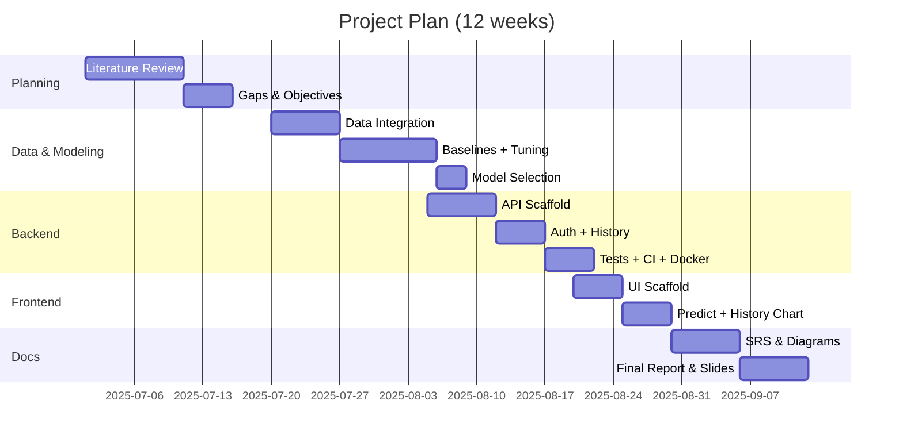

# Gantt & WBS

## WBS (high‑level)
- 1.0 Planning (Review, Gaps, Objectives)
- 2.0 Data & Modeling (Integration, Baselines, Tuning, Selection)
- 3.0 Backend (API, Auth, History, Tests, CI, Docker)
- 4.0 Frontend (Scaffold, Forms, Charting, Polish)
- 5.0 Documentation (SRS, Diagrams, Report, Slides)
